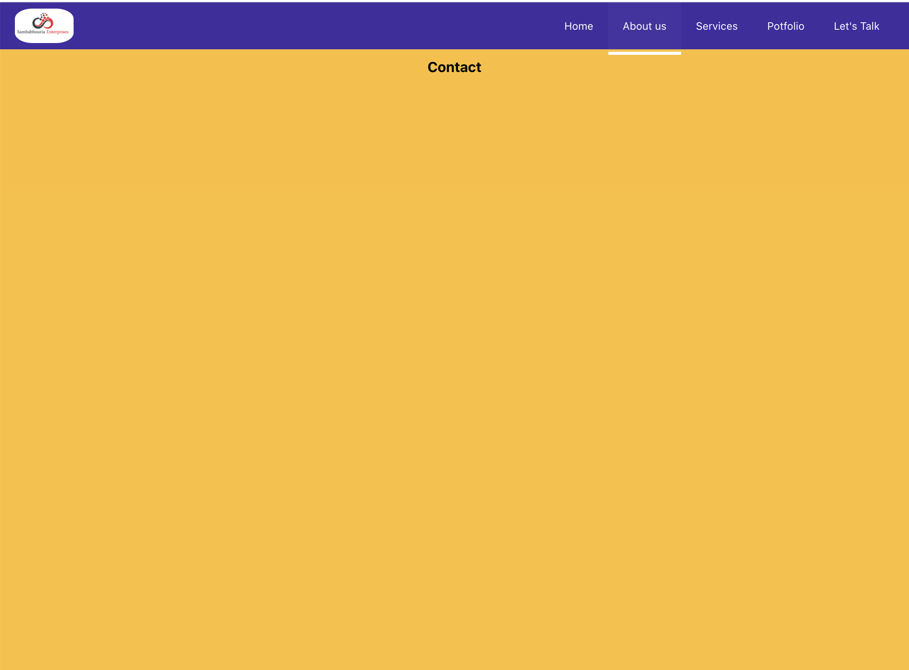
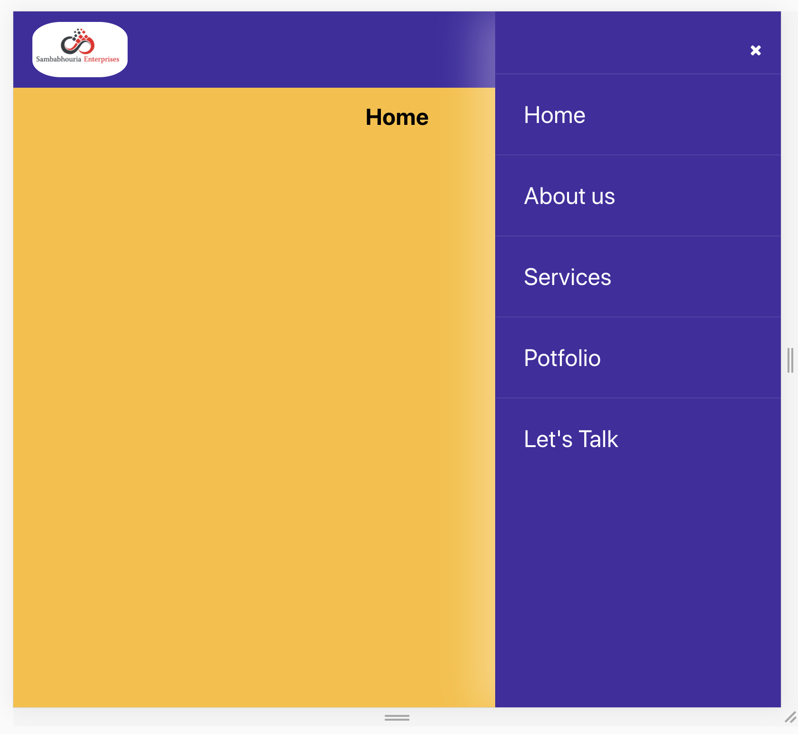

# Getting Started with Create React App

This project was bootstrapped with [Create React App](https://github.com/facebook/create-react-app).

## Available Scripts

In the project directory, you can run:

### `yarn start`

### include a Font Awesome icon in React's render()

import '../node_modules/font-awesome/css/font-awesome.min.css'; 
or
import 'font-awesome/css/font-awesome.min.css';

 render: function() {
    return 
<i className="fa fa-spinner fa-spin">no spinner but why</i>
;
      {/* <i class="fa fa-bars" aria-hidden="true"></i> */}
}

### `screenShot`

